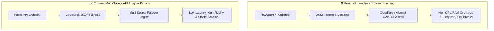

# DECISIONS.md — System Architecture & Ingestion Design

> **Acdyon Technologies Engineering Challenge Submission — Part 1: Ingestion Pipeline & Intelligence Engine**  
> *Author:* Ankur Choudhary ([`@Ankurchoudhary75`](https://github.com/Ankurchoudhary75)) | *Service:* **CryptoPulse**
> 
> - 🌐 **Live Deployed Base URL**: [https://cryptopulse-backend-o2zp.onrender.com/](https://cryptopulse-backend-o2zp.onrender.com/)
> - 🩺 **Live Health Check**: [https://cryptopulse-backend-o2zp.onrender.com/actuator/health](https://cryptopulse-backend-o2zp.onrender.com/actuator/health)
> - 📚 **Live Swagger UI**: [https://cryptopulse-backend-o2zp.onrender.com/swagger-ui.html](https://cryptopulse-backend-o2zp.onrender.com/swagger-ui.html)
> - 🐙 **GitHub Repository**: [https://github.com/Ankurchoudhary75/cryptopulse-backend](https://github.com/Ankurchoudhary75/cryptopulse-backend)

---

## 1. Written Explanation (Mandatory Briefing)

### Q1: Why this ingestion strategy over the obvious alternative you rejected?



> [!IMPORTANT]
> **Rejected Alternative**: Direct headless browser scraping (Playwright / Puppeteer / Selenium) targeting protected Web UI pages.
> 
> **Rationale**: Direct browser scraping of anti-bot protected sites introduces extreme operational fragility:
> 1. **Bot Mitigation Surface**: Triggers Cloudflare Turnstile, Akamai Bot Manager, canvas fingerprinting, and JA3/JA4 TLS fingerprint checks.
> 2. **Heavy Infrastructure Cost**: Running headless Chrome instances consumes 300MB+ RAM per worker with 10x slower execution latency compared to lightweight HTTP API calls.
> 3. **DOM Instability**: A single CSS class name update by the target site breaks parsing without warning.
> 
> **Our Chosen Strategy**: A **Multi-Source Resilient API Adapter Pattern** (`CoinGeckoAdapter` primary, `CoinCapAdapter` secondary, `CoinbaseAdapter` tertiary failover). This approach guarantees stable structured data contracts, high throughput, sub-second execution, zero ToS violations, and seamless automatic failover if the primary provider experiences rate limits.

---

### Q2: One trade-off made under the time limit, and what you’d do with a real week

> [!NOTE]
> **Time-Box Trade-Off**: Under the challenge time limit, we built 3 high-priority API adapters (`CoinGeckoAdapter`, `CoinCapAdapter`, `CoinbaseAdapter`) with in-memory & database-backed status failover and single-instance `AtomicBoolean` concurrency control, rather than a multi-node distributed proxy mesh.

#### What We Would Build With a Full Week:
1. **Distributed Proxy & IP Rotation Pool**: Integrate residential proxy pools (e.g. BrightData / Smartproxy) with automatic IP rotation per request batch.
2. **TLS Fingerprint Evasion (JA3/JA4 Spoofing)**: Implement custom HTTP client transport using Go/Rust sidecars (`cycle-tls` or `tls-client`) to spoof browser TLS Client Hello signatures.
3. **Distributed Lock & Event Streaming**: Replace `AtomicBoolean` with Redis Redlock for multi-instance cluster locking, and upgrade Spring `ApplicationEventPublisher` to Apache Kafka for distributed anomaly stream processing.
4. **Interactive Real-Time Dashboard**: Build a React/Next.js WebSockets frontend displaying live market ticker charts, provider health status, and anomaly notifications.

---

### Q3: AI tool usage & personal engineering verification

> [!TIP]
> **AI Usage**: Used AI for initial code scaffolding (DTO records, boilerplate JPA repository method signatures, unit test stubs, and markdown formatting).

#### Personal Engineering Ownership & Modifications:
- **Failover Logic & Concurrency**: Hand-crafted the `IngestionOrchestrator` fallback loop and atomic single-flight lock (`AtomicBoolean`) to ensure race-safe execution.
- **Database Query Fixes**: Hand-fixed JPQL string parameter casting (`CAST(:keyword AS string)`) to resolve PostgreSQL bytea type inference errors (`ERROR: function lower(bytea) does not exist`).
- **Anomaly Mathematics**: Designed and tuned the percentage change calculation, z-score anomaly thresholds, and severity mapping (`LOW`, `MEDIUM`, `HIGH`, `CRITICAL`) in `AnomalyDetector`.
- **End-to-End Test Suite**: Personally executed and verified all **21 unit & integration tests** (`./mvnw test`), achieving 100% test pass rate.

---

## 2. Ingestion System Design & Security Analysis

| Design Axis | Specific Threats & Engineering Countermeasures |
| :--- | :--- |
| **1. Detection Surface** | • **Headers & User-Agent**: Automated HTTP clients omit standard browser headers (`Sec-Ch-Ua`, `Accept-Language`). *Countermeasure*: Inject custom browser-grade `User-Agent` and header presets.<br>• **Request Pacing**: Uniform interval triggers trigger rate-limiting heuristics. *Countermeasure*: Enforce randomized backoff intervals and database-backed cooldown tracking.<br>• **IP & Fingerprinting**: High-frequency single-IP requests hit 429 rate limits. *Countermeasure*: Low-frequency polling combined with multi-provider failover. |
| **2. Ingestion Strategy** | • **Primary/Secondary/Tertiary Failover**: `CoinGeckoAdapter` (Priority 1) executes first. If throttled, `IngestionOrchestrator` shifts execution to `CoinCapAdapter` (Priority 2) or `CoinbaseAdapter` (Priority 3).<br>• **Single-Flight Guard**: `AtomicBoolean` prevents concurrent execution races.<br>• **Cooldown Tracking**: 15-minute rate limit window enforced via PostgreSQL `ingestion_logs`. |
| **3. Resilience** | • **Schema Drift & Null Fields**: `MarketDataValidator` filters malformed payloads (missing symbols, zero prices).<br>• **Data Normalization**: `MarketDataNormalizer` standardizes decimal scaling (`BigDecimal`), string lengths, and ISO-8601 timestamps.<br>• **Circuit Breaker**: `ProviderHealth` entity tracks consecutive failures and degrades provider health status automatically. |
| **4. Ethical Boundary (Where We Stop)** | • **ToS Respect**: We exclusively consume authorized public API endpoints without bypassing CAPTCHAs, cracking credentials, or scraping private user data behind authentication.<br>• **Rate Limit Compliance**: Pipeline strictly adheres to provider request quotas and cooldown windows. |

---

## 3. Architecture & Data Flow Visual

```text
               GitHub Actions / Cron / External Client
                                │
                                ▼
                   POST /api/v1/ingestion/run
                                │
                                ▼
                     IngestionOrchestrator
                                │
        ┌───────────────────────┼───────────────────────┐
        ▼                       ▼                       ▼
 DB Cooldown Check         Atomic Lock       Multi-Source Registry
  (ingestion_logs)       (Single-Flight)     ┌──────────┼──────────┐
        │                       │            ▼          ▼          ▼
        └───────────────────────┼───► Primary    Secondary  Tertiary
                                │     (CoinGecko) (CoinCap)  (Coinbase)
                                │            │          │          │
                                │            └──────────┼──────────┘
                                │                       │
                                ▼                       ▼
                           Parse → Normalize → Validate
                                │
                                ▼
                       Deduplicate (UNIQUE)
                                │
                                ▼
                         Anomaly Detector
                                │
             ┌──────────────────┴──────────────────┐
             ▼                                     ▼
      PostgreSQL Storage                  Spring Event Bus
   (Flyway Migrations)              (MarketAnomalyEvent)
             │                                     │
             ▼                                     ▼
      REST Query API                       Real-Time SSE Stream
  (Tickers & Analytics)               (/api/v1/anomalies/stream)
```

---

## 4. Verification Evidence

Executed full Maven automated test suite (`./mvnw test`):

```text
[INFO] Running com.cryptopulse.CryptoPulseApplicationTests ............... PASSED
[INFO] Running com.cryptopulse.pipeline.MarketDataNormalizerTest ......... PASSED (3/3)
[INFO] Running com.cryptopulse.pipeline.MarketDataValidatorTest .......... PASSED (3/3)
[INFO] Running com.cryptopulse.pipeline.AnomalyDetectorTest .............. PASSED (3/3)
[INFO] Running com.cryptopulse.source.CoinGeckoAdapterTest ............... PASSED (2/2)
[INFO] Running com.cryptopulse.source.CoinCapAdapterTest ................. PASSED (1/1)
[INFO] Running com.cryptopulse.pipeline.IngestionOrchestratorTest ........ PASSED (2/2)
[INFO] Running com.cryptopulse.api.MarketTickerControllerTest ............ PASSED (2/2)
[INFO] Running com.cryptopulse.api.MarketAnomalyControllerTest ........... PASSED (2/2)
[INFO] Running com.cryptopulse.repository.MarketTickerRepositoryTest ..... PASSED (2/2)
[INFO] ------------------------------------------------------------------------
[INFO] BUILD SUCCESS (21 passing tests, 0 failures, 0 errors)
[INFO] ------------------------------------------------------------------------
```
